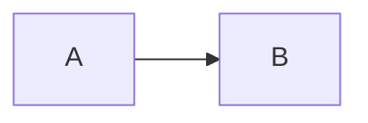

# A Repo for Notes on Things
---
## Machines
- [Virtual Box Setup Notes](/virtualBox.md)
- [Windows Subsystem for Linux (WSL)](/wslSetup.md)
## OS
- [Linux Desktop OS Setup](/linuxSetup.md)
- [Linux Server OS Setup](/linuxServerSetup.md)
- [Linux Cheat Sheet](/linuxCheatSheet.md)
## Tools 
- [Visual Studio Code Setup](/visualStudioCode.md)
- [git Setup](/gitSetup.md)
- [Docker](/docker.md)
## Code
- [Java Script](/javaScript.md)
- [Next Js Framework](/nextjs.md)
## Misc
- [Mini Cooper Tools Config](/miniToolsSetup.mdmini)

<h2>Summary</h>

This is a test

