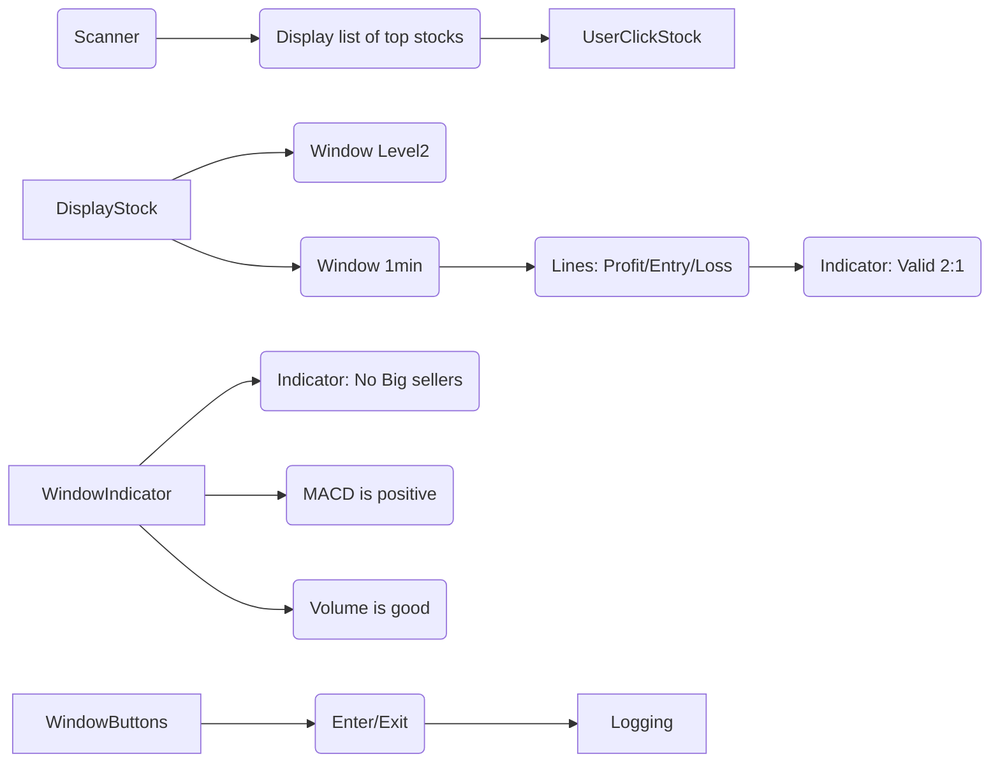

# Trading
[Return to Home](readMe.md)

## Some Types of Trading
| Strategy | What to Scan For |
| --- | --- |
| Momentum | High relative volume, price breakout, strong trend |
| Swing Trading | Pullbacks to moving averages, bullish reversals |
| Day Trading | Gap-ups, unusual volume, volatility |
| Value Investing | Low P/E, strong earnings growth, low debt |
| Dividend Investing | High yield, dividend growth history |

### Momentum Scanner
Possible
- Price > 50-day MA
- 20-day volume > average volume
- Relative Strength (RS) > 80
- New 52-week highs

## Markets
Possible
- Futures,
- Foreign Exchange (Forex),
- Crypto, 
- SMB, 
- Large Cap
Our Targer
- SMB
## Data Sources
Popular options:
- Yahoo Finance (free)
- Alpha Vantage
- Finnhub
- Polygon.io
- IEX Cloud
- Twelve Data
For more serious scanners:
- Polygon
- Nasdaq Data Link
- Alpaca Market Data

## Comparison

| Provider                         | Cost to Start        | Historical Data | Minute Data          | Fundamentals | Real-Time                 | Best For                            |
| -------------------------------- | -------------------- | --------------- | -------------------- | ------------ | ------------------------- | ----------------------------------- |
| Yahoo Finance (`yahoo-finance2`) | Free                 | Excellent       | Limited              | Good         | Mostly delayed/unofficial | Hobby projects, swing trading       |
| Finnhub                          | Free tier available  | Good            | Good                 | Excellent    | Better than Yahoo         | Scanner + fundamentals              |
| Alpha Vantage                    | Free tier available  | Good            | Limited on free tier | Good         | Limited                   | Learning and prototypes             |
| Polygon                          | Paid for serious use | Excellent       | Excellent            | Basic        | Excellent                 | Day trading and production scanners |
| Twelve Data                      | Free tier available  | Good            | Good                 | Limited      | Good                      | Charting apps                       |
| Financial Modeling Prep          | Free tier available  | Good            | Moderate             | Excellent    | Limited                   | Value investing scanners            |

## Time of day
-7:00 to 11:00
## Account
$500
## Selection
- 98% of the market stays within 2% of it's opening price (source?)
    - SPX does 10% per year
    - 10%/12 months is ~0.8% per month
    - even less per day.
- You need a fast changing stock.
- scanners help you find the ones with the most price change.
- Commission from brokers push these lists.
- Look for things up 5 to 10%
### Breaking down each entry
- First percentage change from close, at least 10%
- Second Volume to Float
    - Float is the number of shares from the company.
    - Volume is the absolute summation of the number of all shares traded.
        - Independent of buy or sell.
    - Volume should be many times greater then float.
    - This means activity.
    - Somewhat correlates to demand.
- Relative Volume
    - Today's Volume / average volume of the last 30 days.
    - High numbers here indicate unusual activity
        - Which is what we are looking for.

### Rules
Looking for Demand and Contrained Supply
1) Demand Indicator: Price between 2 and 20
2) Demand Indicator: Relative Volume 5x
3) Demand Indicator: Price change since closing >10%
5) Demand Indicator: News catalyst
4) Supply Contrain IndicatorFloat less then 20M shares
    - Lower is better

## Managing Risk
- Small account
- Simulator practice
- Trade should be 2:1 profit to loss
    - Position is $500 in
    - Set Stop Loss at $50
    - Target to make $100
- 33% accuracy is break even
- 50% accuracy is 

## Entry
- Big green candles with big volumes
- 1 or 2 Smaller pull backs with smaller volumes
- Not clear where to buy
    - Enter buy at top of second red
    - Or maybe at top of first new turn around?
## Exit
- Price going down
- Volume going down
- Tier 2 big seller showing up in the ASK.

## When to stop
- Hiting max loss
- After hitting daily goal giving back half of daily goal.
- 20% off high
- If I feel angry

## Trading Process

## Todo
- Better understand how we use Level 2 data
- Decide on realtime data provider
    - 1 second data
    - 1 min data
    - Level 2
    - Volume/Float
- Watch a stock unfold in real time on the 1min
    - Could do this for free with finnhub
- Decide on trading provider
    - Who is warrior trading using